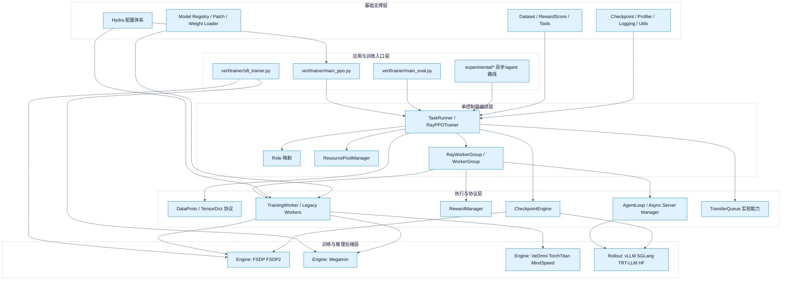

# verl 仓库架构与设计分析

本文基于当前仓库代码、README 与 docs 中的设计文档，对 `verl` 的整体架构、核心组件关系、主训练链路、扩展机制与设计思路做一次偏工程视角的梳理。目标不是复述功能清单，而是解释这个仓库为什么要这样分层、各模块如何协作，以及它如何在灵活性和性能之间做权衡。

## 1. 项目定位

`verl` 是一个面向大语言模型后训练的分布式强化学习框架。它的目标不是只实现某一个 PPO/GRPO 算法，而是提供一套可以承载多种 RL 后训练数据流的基础设施。

从代码和文档来看，它的核心定位有三层：

1. 它是一个 **RL 训练框架**，支持 PPO、GRPO、DAPO、SFT、Diffusion/VLM、多轮 agentic RL 等多类后训练任务。
2. 它是一个 **分布式编排框架**，通过单控制器加多 worker 的方式，把 rollout、actor、critic、reward、reference policy、teacher model 等角色组织成可调度的数据流。
3. 它是一个 **后端适配层**，把 FSDP/FSDP2、Megatron、VeOmni、TorchTitan、vLLM、SGLang、TensorRT-LLM 等已有训练/推理基础设施统一到一套上层接口中。

一句话概括：`verl` 的重点不是“自己发明一个新的训练内核”，而是“把现有训练与推理基础设施组合成面向 RLHF/Agentic RL 的可扩展执行系统”。

## 2. 总体设计思想

仓库的设计核心是文档中反复提到的 **Hybrid-Controller / HybridFlow**。它把系统拆成两层控制逻辑：

- **高层单控制器（MPMD）**：由 `RLTrainer`/`RayPPOTrainer` 这类 Driver 负责，把整条 RL pipeline 视作一个可编排的图，决定“什么时候 rollout、什么时候打分、什么时候训练、资源怎么放”。
- **底层多控制器（SPMD）**：具体到模型训练和推理时，又回到 FSDP、Megatron、vLLM、SGLang 等后端各自熟悉的分布式执行模式，由后端自己处理 DP/TP/PP/EP/CP 等并行细节。

这种设计解决了两个在 LLM RL 系统里经常冲突的问题：

1. **如果全部交给 SPMD 训练脚本管理**，很难表达 PPO 这种多阶段 DAG，也不利于中间结果观测和复杂资源编排。
2. **如果全部交给高层 Python/Ray 逐步调度**，又会把训练核心路径做慢，无法复用成熟的高性能训练/推理后端。

因此，`verl` 的做法是：

- 在“算法编排”层追求灵活。
- 在“模型执行”层复用现成高性能后端。
- 在两者之间用统一协议、worker 抽象和资源池抽象解耦。

## 3. 架构总览

### 3.1 分层视图



### 3.2 一句话看各层职责

- **应用入口层**：决定当前跑哪条训练/评估路线。
- **单控制器编排层**：负责角色划分、资源分配、worker 创建和训练阶段调度。
- **执行与协议层**：负责数据协议、worker API、reward、agent loop、参数同步等跨组件协作能力。
- **后端层**：真正执行模型训练、推理和权重更新。
- **支撑层**：提供配置、数据集、日志、checkpoint、模型注册等基础设施。

## 4. 仓库目录与模块职责

### 4.1 主干目录

| 目录 | 作用 |
| --- | --- |
| `verl/trainer` | 主入口、Trainer 实现、算法逻辑、训练配置 |
| `verl/workers` | 各类 worker、训练 engine 适配、rollout、reward manager |
| `verl/single_controller` | 单控制器执行框架，封装 WorkerGroup、ResourcePool、调度/收集语义 |
| `verl/protocol.py` | 统一数据协议 `DataProto`，承接训练/推理/RPC 之间的数据交换 |
| `verl/models` | 模型注册、transformers/mcore/diffusers 适配与 patch |
| `verl/utils` | 配置、分布式、checkpoint、dataset、profiling、logging、kernel 等基础设施 |
| `verl/checkpoint_engine` | trainer 与 rollout 间的参数同步抽象层 |
| `verl/tools` | tool calling、MCP/search/sandbox 等工具集成 |
| `verl/experimental` | 仍在演进中的异步策略、agent loop、reward loop、VLA 等能力 |
| `examples` | 不同算法/模型/硬件组合的启动脚本和样例 |
| `docs` | 官方设计说明、算法文档、扩展指南、性能调优文档 |
| `tests` | 单元测试、集成测试、分布式/硬件相关测试 |

### 4.2 主干与实验区的边界

这个仓库不是把所有东西都塞进一个 Trainer 里，而是把“稳定主干”和“前沿探索”有意区分开：

- `verl/trainer/main_ppo.py`、`verl/workers/engine*`、`verl/single_controller/*` 属于当前主干路径。
- `verl/experimental/fully_async_policy`、`verl/experimental/one_step_off_policy`、`verl/experimental/agent_loop`、`verl/experimental/vla` 代表对未来异步化、Agent 化、VLA 化的延伸。

这意味着它的架构不是静态的。主干部分提供稳定抽象，实验目录则承担“新数据流、新调度策略、新交互范式”的孵化任务。

## 5. 主训练链路

### 5.1 从入口到训练开始

当前 RL 主入口是 `verl/trainer/main_ppo.py`，大致过程是：

1. 通过 Hydra 读取 `verl/trainer/config/ppo_trainer.yaml` 及其 defaults 链。
2. 自动选择设备类型，迁移老版 reward 配置。
3. 初始化 Ray 集群运行时环境。
4. 启动 `TaskRunner`。
5. 由 `TaskRunner` 决定使用哪种 worker 实现和资源池布局。
6. 创建 `RayPPOTrainer`，初始化 worker，加载数据，开始 `fit()`。

这里有一个很重要的设计点：**入口脚本本身并不直接关心 FSDP、Megatron、vLLM 的执行细节**。它只负责把配置转换为角色、资源和调度图。

### 5.2 PPO 主链路的核心数据流

```mermaid
%%{init: {
  "theme": "base",
  "themeVariables": {
    "background": "#f8fafc",
    "primaryColor": "#dbeafe",
    "primaryTextColor": "#111827",
    "primaryBorderColor": "#2563eb",
    "lineColor": "#64748b",
    "secondaryColor": "#fef9c3",
    "tertiaryColor": "#dcfce7",
    "clusterBkg": "#ffffff",
    "clusterBorder": "#cbd5e1"
  }
}}%%
flowchart LR
    U[Parquet/RLHFDataset] --> V[RayPPOTrainer]
    V --> W[ActorRollout WorkerGroup]
    W --> X[Rollout Server / AgentLoop]
    X --> Y[生成 response / trajectory]
    Y --> Z[RewardManager / RewardModel / Rule-based Reward]
    Z --> A[计算 token_level_scores]
    A --> B[Actor: old_log_probs / optional ref_log_prob]
    B --> C[Critic: values]
    C --> D[Advantage & Return 计算]
    D --> E[Actor 更新]
    D --> F[Critic 更新]
    E --> G[Checkpoint / Validation / Logging]
    F --> G
```



### 5.3 训练链路中的角色分工

在 `RayPPOTrainer` 中，逻辑被分成多个角色：

- `ActorRollout` 或 `ActorRolloutRef`：既承担 rollout，也承担 actor 训练，某些配置下还融合 reference policy。
- `Critic`：价值网络训练与 value 预测。
- `RefPolicy`：在需要 KL loss 或 KL reward 时提供参考策略对数概率。
- `RewardModel`：当奖励由模型给出时启用。
- `TeacherModel`：在 distillation 场景中启用。

这种角色设计的价值在于：

1. 算法层可以围绕“角色”思考，而不直接围绕“GPU 进程”思考。
2. 资源层可以把多个角色 colocate 到同一池子，也可以拆到不同资源池。
3. 同一角色可以换底层后端，而调用方代码基本不变。

## 6. 单控制器层：仓库真正的控制平面

### 6.1 为什么需要 `single_controller`

`verl/single_controller` 是整个仓库的关键基础设施。它的设计目标是：

- 保留 Python 级别的可编排性和可调试性。
- 隐藏多 Ray actor、多进程、多 GPU 的复杂调用细节。
- 允许上层以“调用一个方法”的方式触发一组分布式 worker 的协同执行。

它本质上做的是把普通 Python 方法，提升成“分布式群组方法”。

### 6.2 核心对象

#### `ResourcePool`

负责描述资源池中每个节点上有多少进程/GPU，可理解为一种抽象资源切片。它不直接做调度决策，但为后续的 worker 放置提供边界。

#### `WorkerGroup`

这是最关键的抽象。它管理一组远端 worker，并把 worker 上通过装饰器注册的方法，绑定到 group 对象上。上层调用 `worker_group.generate_sequences(...)` 时，实际上会触发：

1. 参数分发。
2. 多 worker 并行执行。
3. 结果收集与合并。

#### `@register`

这是 `verl` 非常典型的工程技巧。worker 方法通过 `@register(dispatch_mode=..., execute_mode=...)` 声明自身的分发和执行语义，而不是把这些规则写死在调度器里。

这意味着：

- worker 作者只需要定义方法的“并行语义”。
- `WorkerGroup` 会在初始化时自动发现并绑定这些方法。
- 调用方不用关心该方法是广播、切分、还是 all-to-all。

### 6.3 这个抽象解决了什么问题

对 PPO/GRPO 这类算法来说，最麻烦的不是单次前向或反向，而是多阶段多角色的 pipeline：

- rollout 前后数据格式不同。
- 某些阶段要切 batch，某些阶段要广播配置。
- 某些阶段只在主 rank 返回，某些阶段需要聚合结果。

`single_controller` 把这类“阶段切换 + 群组调用”的复杂性统一抽象掉了。因此它是这个仓库可扩展性的核心，而不是一个普通的 Ray 包装层。

## 7. 数据协议层：`DataProto` 为什么重要

### 7.1 统一的数据交换对象

`verl/protocol.py` 定义了 `DataProto`。它是仓库中训练、rollout、reward、worker 之间交换数据的标准容器。

`DataProto` 大体分成三部分：

- `batch`：张量数据，底层通常是 `TensorDict`。
- `non_tensor_batch`：非张量数据，如字符串、uid、结构化元数据。
- `meta_info`：附加上下文信息。

### 7.2 为什么不用普通 `dict`

因为在 LLM RL 场景中，数据交换不仅仅是“传一堆 tensor”：

- 既有 prompt/response/logprob/value 这类规则张量。
- 也有 image/video/tool call/trace/uid 这类不规则数据。
- 还要考虑跨 worker 切分、拼接、padding、序列不等长、nested tensor 等问题。

`DataProto` 的价值不在于类型定义本身，而在于它让系统里所有阶段都围绕一个统一协议工作，这样：

1. `dispatch_fn/collect_fn` 可以复用。
2. rollout、reward、actor、critic 的接口更稳定。
3. 后续替换传输层时，不需要重写每个业务组件。

### 7.3 当前的演进方向

从文档和代码能看出，这一层还在持续演进：

- 历史上大量使用 `DataProto`。
- 新版本逐渐加强 `TensorDict`/nested tensor 的使用。
- 文档中明确提到未来会进一步减少 padding 传输，优化大规模多模态/agent 任务的数据传输效率。

所以这里可以理解为：**协议层已经稳定，但具体载体还在向更高效的张量容器迁移。**

## 8. Worker 与 Engine：业务角色和执行内核分离

### 8.1 新旧两套 worker 路线并存

当前代码里有两类 worker：

- 传统实现：`verl/workers/fsdp_workers.py`、`verl/workers/megatron_workers.py`
- 新实现：`verl/workers/engine_workers.py`

在 `main_ppo.py` 里，默认 `trainer.use_legacy_worker_impl: disable`，说明主干方向已经偏向新的 `engine_workers` 路线。

### 8.2 新实现的分层方式

新实现里，`TrainingWorker` 是一个更通用的执行容器：

- 它负责初始化分布式环境。
- 根据配置通过 `EngineRegistry` 创建具体 engine。
- 对外暴露 `train_batch`、`train_mini_batch`、`to`、`reset` 等统一接口。

这意味着 worker 更像“编排执行壳”，而 engine 才是“真正的训练后端”。

### 8.3 `BaseEngine` 的意义

`verl/workers/engine/base.py` 定义了 `BaseEngine` 接口，抽象出：

- `initialize`
- `train_mode` / `eval_mode`
- `optimizer_zero_grad`
- `optimizer_step`
- `lr_scheduler_step`
- `forward_backward_batch`
- `infer_batch`
- `get_per_tensor_param`
- `save_checkpoint` / `load_checkpoint`

这层抽象非常重要，因为它把上层从 FSDP/Megatron/VeOmni 的差异中解耦了出来。对于上层 Trainer 来说，底层是 FSDP2 还是 Megatron，本质上只是 `strategy` 配置不同。

### 8.4 Engine Registry 的设计价值

Engine 注册机制带来几个直接好处：

1. 新增后端时，上层 Trainer 基本不需要改。
2. 同一个 Trainer 可以支持多种策略，只通过配置切换。
3. 模型类型和后端类型的组合关系可以在 registry 中集中管理。

这是典型的“依赖倒置”设计：算法层依赖抽象接口，不依赖后端实现。

## 9. Rollout 子系统：从离线批推理转向服务化推理

### 9.1 为什么 rollout 是单独系统

在 RLHF 中，rollout 往往是吞吐和尾延迟瓶颈，尤其在多轮 agent 任务里更明显。`verl` 当前的设计明确把 rollout 看成独立子系统，而不是 actor 训练时顺带做一次生成。

### 9.2 抽象接口

`verl/workers/rollout/base.py` 里定义了 `BaseRollout`，核心接口包括：

- `resume(tags)`
- `update_weights(weights)`
- `release()`
- `generate_sequences()`

这组接口说明 rollout 被设计为一个“可唤醒、可更新、可释放”的在线推理服务，而不是只会执行 `generate()` 的离线函数。

### 9.3 统一接入多种推理后端

当前 registry 中可见的 rollout 后端包括：

- `vllm`
- `vllm_omni`
- `sglang`
- `trtllm`

其共同点是：上层只知道自己在调用 rollout server adapter，不需要知道底层是 OpenAI-compatible server、HTTP server 还是内嵌引擎。

### 9.4 多轮 Agent 化扩展

`verl/experimental/agent_loop/agent_loop.py` 展示了 rollout 子系统的另一个重要方向：

- 不再只处理单轮 prompt -> response。
- 而是管理一个多轮交互 loop。
- 内部可以做 sticky session、负载均衡、工具调用、环境交互、trace 记录。

这意味着 `verl` 对 rollout 的理解已经从“生成一段文本”升级为“执行一段轨迹”。这也是它能支持 agentic RL 的关键原因。

## 10. Reward 子系统：奖励不是一个函数，而是一层可插拔服务

### 10.1 奖励来源的复杂性

这个仓库对 reward 的设计明显不是“传一个 `reward_fn` 完事”，而是承认真实场景中的奖励是异构的：

- 规则奖励
- 判别式 RM
- 生成式 RM
- 外部 sandbox / tool / API
- 混合奖励

### 10.2 抽象层次

`verl/workers/reward_manager/abstract.py` 里的 `AbstractRewardManager` 定义了统一接口，`registry.py` 提供注册机制。这说明 reward manager 在系统里的地位类似 engine/rollout：都是可替换的系统组件，而不是业务函数。

### 10.3 这层设计的好处

1. 规则奖励和模型奖励可以共存。
2. 奖励逻辑可以独立扩展，不污染 Trainer 主流程。
3. 奖励可以走 colocate，也可以拆出去形成 standalone 服务。
4. 面向多轮 Agent 场景时，reward 仍可复用已有 manager 机制。

从架构角度看，这一层是在把“奖励计算”从算法逻辑里剥离成服务接口。

## 11. Checkpoint Engine：为异步化做准备的参数同步层

### 11.1 为什么不是直接 `load_state_dict`

如果 trainer 和 rollout colocate，参数同步看起来只是同机内存问题；但一旦进入异步、解耦、多节点、异构硬件场景，权重同步会变成系统瓶颈。

所以 `verl/checkpoint_engine/base.py` 专门引入了 `CheckpointEngine` 抽象，负责 trainer 到 rollout 的参数传递。

### 11.2 抽象内容

它定义了：

- `prepare`
- `build_topology`
- `init_process_group`
- `finalize`
- `send_weights`
- `receive_weights`

这说明它不是单纯的 checkpoint save/load，而是更接近“参数流式同步引擎”。

### 11.3 这个设计背后的意图

它在为以下能力打基础：

- trainer/rollout 解耦部署
- 局部 rollout 继续服务时的权重切换
- 异构硬件或弹性扩缩容环境中的权重分发
- 更低开销的 P2P 或 RDMA 传输

因此，Checkpoint Engine 是仓库从同步 RL 走向 fully async/off-policy 架构时的关键基础设施之一。

## 12. 配置体系：Hydra 不是附属品，而是架构的一部分

### 12.1 配置树的组织方式

`verl/trainer/config/ppo_trainer.yaml` 通过 Hydra defaults 把配置分解为多个子域：

- `model_engine`
- `actor_rollout_ref.actor`
- `actor_rollout_ref.rollout`
- `actor_rollout_ref.ref`
- `critic`
- `reward`
- `algorithm`
- `data`
- `distillation`

这套配置结构几乎就是运行时架构图的镜像。

### 12.2 为什么这很重要

很多训练项目把配置当作参数堆。`verl` 不是。它把配置设计成对系统分层的映射：

- 哪些组件存在，由配置决定。
- 每个组件使用什么后端，由配置决定。
- 是否 colocate、是否启用 reward model、是否启用 reference policy、是否启用 LoRA，也主要由配置决定。

所以在这个仓库里，Hydra 不只是“方便调参”，而是 **架构装配器**。

## 13. 模型与后端适配层

### 13.1 `verl/models` 的角色

`verl/models` 不是简单的 Hugging Face wrapper，而是承担了多类后端兼容与模型 patch 的工作：

- `transformers/*`：面向 HF 模型族的适配。
- `mcore/*`：面向 Megatron-Core/Bridge 的适配与权重转换。
- `diffusers_model/*`：面向 diffusion 场景。
- `registry.py` / `weight_loader_registry.py`：统一注册和加载机制。

### 13.2 这一层为什么独立存在

因为在 LLM RL 系统里，模型适配往往不只是“加载权重”，还涉及：

- 注意力实现差异
- position id / rope / multimodal 输入处理
- LoRA / PEFT 开关
- vLLM / Megatron / HF 之间的权重映射

把这层单独隔离出来，可以避免训练器和 worker 中充斥模型特例逻辑。

## 14. `experimental` 模块代表的演进方向

从架构演进角度看，`experimental` 不是边角料，而是路线图：

- `fully_async_policy`：向完全异步、流式、解耦 trainer/rollout 演进。
- `one_step_off_policy`：在严格 on-policy 和 fully async 之间做折中。
- `agent_loop`：把 rollout 提升到多轮 agent 轨迹执行。
- `reward_loop`：把 reward 进一步服务化和异步化。
- `vla`：把框架扩展到 Vision-Language-Action 场景。

从这个角度看，仓库的主轴不是“做一个 PPO trainer”，而是“搭一套能不断容纳新 RL 数据流的底座”。

## 15. 整体组件关系总结

### 15.1 组件之间的作用和依赖关系

| 组件 | 主要职责 | 依赖谁 | 被谁依赖 |
| --- | --- | --- | --- |
| `main_ppo.py` | 启动入口、组装配置、启动 Ray 任务 | Hydra、Ray、TaskRunner | 用户脚本、examples |
| `TaskRunner` | 将配置转换为角色/资源/worker 组合 | Role、Worker、ResourcePool | `RayPPOTrainer` |
| `RayPPOTrainer` | 定义 RL 主循环、训练阶段切换、指标/验证/checkpoint | WorkerGroup、Dataset、Reward、Algo | 入口层 |
| `WorkerGroup` | 把单方法调用扩展成分布式群组调用 | Worker、dispatch/collect 规则 | Trainer |
| `TrainingWorker` | 统一封装训练执行逻辑 | Engine、distributed utils | WorkerGroup |
| `BaseEngine`/各后端 Engine | 执行真正的前向/反向/优化/存储 | 模型、优化器、并行后端 | TrainingWorker |
| `BaseRollout`/ServerAdapter | 统一推理/rollout 服务接口 | vLLM/SGLang/TRT-LLM | ActorRollout/AgentLoop |
| `RewardManager` | 计算奖励、封装多来源 reward 逻辑 | 规则函数、RM、外部服务 | Trainer/RewardLoop |
| `DataProto` | 统一数据交换协议 | TensorDict、numpy、torch | 几乎所有主链路模块 |
| `CheckpointEngine` | 训练权重到 rollout 的同步抽象 | transport backend | rollout/trainer 异步架构 |

### 15.2 控制流和数据流的关系

`verl` 最值得注意的一点，是它在架构上明确地区分了：

- **控制流**：由单控制器决定下一步做什么。
- **数据流**：由 `DataProto`、TransferQueue、CheckpointEngine 等机制承载真实 payload。

这使得系统不会把“大量 tensor 传输”与“流程调度判断”硬耦合在同一个 Python driver 上。当前主干里这两者还没有完全分离到极致，但从 v0.7 文档和实验目录可以看出，这是明确的演进方向。

## 16. 这个项目的设计优点

### 16.1 强扩展性

它把训练后端、rollout 后端、reward 逻辑、调度模式都做成了可替换抽象，因此对新模型、新推理引擎、新 RL 算法、新硬件都比较友好。

### 16.2 算法和系统分层清晰

算法逻辑主要留在 `trainer/ppo/core_algos.py`、`ray_trainer.py` 一带，分布式执行复杂性主要放在 `single_controller` 和 `workers/engine`。这让系统复杂，但不是混乱。

### 16.3 能适配真实生产场景

不是只为学术单机实验设计，而是明确考虑：

- 多节点
- 多后端
- 多角色 colocate/disaggregate
- 多轮工具调用
- 异步化与弹性扩缩容

### 16.4 兼容演进路线

同步 on-policy、一步 off-policy、fully async、agentic rollout 并没有被写死成互斥系统，而是在同一架构下逐步扩展。

## 17. 这个项目的复杂点与代价

### 17.1 学习成本高

仓库不是“读一个 Trainer 文件就懂”的类型。真正理解它，需要同时看：

- 入口与配置
- WorkerGroup
- worker/engine 分层
- rollout/reward/checkpoint 扩展点

### 17.2 新旧实现共存增加认知负担

目前 legacy worker 与 new engine worker 并存，短期内有助于兼容，长期看会提高理解门槛。

### 17.3 抽象层多，排障门槛不低

高抽象意味着强复用，但也意味着问题定位可能跨多层：配置层、调度层、worker 层、后端层、模型层都可能出问题。

## 18. 面试视角：面试官可能关心的问题与参考回答

### Q1：`verl` 的核心架构思想是什么？

**答：**

核心是 Hybrid-Controller。高层采用单控制器来编排 RL 数据流，负责角色划分、资源分配和阶段调度；底层训练与推理仍使用 FSDP、Megatron、vLLM、SGLang 这类成熟后端执行 SPMD 并行计算。这样既保留了复杂 RL pipeline 的可表达性，也避免了自己重写一套高性能训练/推理内核。

### Q2：为什么不直接用纯 PyTorch DDP 或纯 Ray Actor？

**答：**

纯 DDP 适合同构的单阶段训练，不擅长表达 PPO 这种多阶段、多角色、带中间结果流转的 DAG。纯 Ray Actor 虽然灵活，但如果每个阶段都手写多 actor 协作，分发/收集/聚合逻辑会非常重复且难维护。`verl` 通过 `WorkerGroup + register` 把“灵活调度”和“多进程协同”结合起来，属于两者之间的折中方案。

### Q3：`DataProto` 解决了什么问题？

**答：**

它提供了统一的数据交换协议，能同时承载张量、非张量和元信息，适配 rollout、reward、actor、critic 之间不同阶段的数据形态。它的价值不只是一个容器，而是让 dispatch/collect、padding、拼接、序列不等长处理都能围绕同一种协议实现，从而降低跨组件耦合。

### Q4：`WorkerGroup` 的价值是什么？

**答：**

它把普通 worker 方法提升成“分布式群组方法”。上层像调用一个本地方法一样触发多远端 worker 的并行执行，而分发、执行、收集规则由装饰器元信息驱动。这显著降低了上层 Trainer 对底层并行细节的感知，是整个系统控制平面的关键。

### Q5：新 `engine_workers` 相比旧 `fsdp_workers/megatron_workers` 的改进是什么？

**答：**

新实现把“业务角色”和“执行后端”拆得更清楚。`TrainingWorker` 主要负责统一生命周期和接口，具体训练细节下沉到 `BaseEngine` 及其各个实现中。这样新后端接入时，更多是扩展 engine，而不是复制整套 worker 逻辑，复用性更强。

### Q6：为什么 rollout 要做成 server 模式？

**答：**

因为多轮 agent 任务下，请求长度和轮数不稳定，离线 batch 推理的效率和灵活性都不足。server 模式可以利用动态 batching、prefix cache、sticky session、异步请求等能力，更适合真实 agent rollout。它也降低了对推理引擎内部实现的侵入性，便于接入 vLLM、SGLang、TRT-LLM。

### Q7：为什么要单独设计 `CheckpointEngine`？

**答：**

在同步 colocate 训练里，参数同步问题不明显；但一旦进入 trainer/rollout 解耦、多节点、异步和弹性场景，权重传输会变成系统瓶颈。`CheckpointEngine` 把权重同步抽象成独立层，允许后续基于 NCCL、NIXL、Mooncake 等不同传输后端优化 trainer 到 rollout 的参数更新路径。

### Q8：这个项目里最体现工程成熟度的设计点是什么？

**答：**

我认为是“把配置结构、角色模型和执行抽象对齐”。Hydra 配置树、Role/ResourcePool 模型、WorkerGroup、Engine/Rollout/Reward 接口是一套相互映射的系统，而不是各自独立堆出来的模块。这说明它不是只为某个实验脚本设计，而是按平台化思路构建的。

### Q9：如果让你扩展一个新的训练后端，你会从哪里下手？

**答：**

优先实现 `BaseEngine` 的一套后端适配，并把它注册到 `EngineRegistry`。如果数据并行切分、收集语义和现有 worker 能兼容，上层 Trainer 和 `TrainingWorker` 不需要大改。只有当新后端的角色形态或通信语义差异很大时，才需要扩展 worker 或 dispatch/collect 逻辑。

### Q10：如果让你扩展一个新的 agent 环境或工具调用流程，应该怎么做？

**答：**

我会优先沿着 `experimental/agent_loop` 的抽象做，把环境交互封装到新的 AgentLoop 实现里，而不是直接改 Trainer 主循环。因为 rollout 在这里已经被抽象成轨迹执行系统，新的环境逻辑应该作为 rollout/agent loop 扩展点接入，这样能保持训练框架主干稳定。

### Q11：这个仓库最大的架构风险是什么？

**答：**

我认为是抽象层很多、主干和实验路径同时快速演进，可能导致心智负担上升。如果没有足够清晰的边界和迁移策略，legacy/new worker、DataProto/TensorDict、同步/异步 trainer 这些路线会在一段时间内增加维护复杂度。

### Q12：如果面试官让你评价这个仓库的设计取舍，你会怎么说？

**答：**

它明显偏向“平台化、可扩展、面向复杂场景”的取舍，而不是“代码最少、链路最短”的取舍。代价是系统复杂、理解成本高；收益是它能承载多种 RL 数据流、推理后端、训练后端和多轮 agent 场景。对于一个希望服务真实大规模后训练的平台来说，这是合理方向。

## 19. 结论

从当前代码来看，`verl` 的本质不是一个单纯的 PPO/GRPO 训练脚本集合，而是一套面向 LLM 后训练的分布式系统框架。它围绕以下几个关键点建立了稳定骨架：

- 用单控制器表达复杂 RL 数据流。
- 用 worker group 抽象隐藏分布式协作细节。
- 用统一协议打通 rollout、reward、actor、critic 之间的数据交换。
- 用 engine/rollout/checkpoint registry 对接异构训练与推理后端。
- 用 experimental 路线为 fully async、agentic RL、VLA 等新场景预留演进空间。

如果从工程架构角度理解这个项目，可以把它看作：

> 一套以 RL post-training 为中心、以 Ray 单控制器为编排骨架、以多后端统一抽象为执行底座、以 agent/async 扩展为未来方向的分布式训练平台。

这也是为什么它的代码体量很大，但主干思路其实非常清晰：**控制平面统一，执行平面解耦，协议层稳定，后端层可替换。**

---

## 附录 A：什么是 PPO / GRPO / DAPO？

这三个都是用于训练 LLM 的强化学习算法，是 verl 的主要服务对象。它们都属于 policy gradient 家族，区别在于「如何估计优势 advantage」和「如何稳定训练」。

### A.1 PPO（Proximal Policy Optimization，OpenAI 2017）

经典 RLHF 算法。需要 4 个模型：

- **actor**：策略，待训练
- **critic**：价值网络，估计 baseline
- **reference**：冻结快照，做 KL 约束
- **reward**：打分模型或规则函数

优势用 GAE 计算：

$$\hat{A}_t = \sum_k (\gamma\lambda)^k \delta_{t+k},\quad \delta_t = r_t + \gamma V(s_{t+1}) - V(s_t)$$

用 clip ratio 防止策略一步更新过大：

$$\mathcal{L}^{CLIP} = \mathbb{E}_t \big[\min(\rho_t \hat{A}_t,\ \text{clip}(\rho_t, 1-\epsilon, 1+\epsilon)\hat{A}_t)\big]$$

问题：critic 与 actor 同尺寸，显存开销大。

### A.2 GRPO（Group Relative Policy Optimization，DeepSeek 2024）

PPO 的简化版，**去掉 critic**。对每个 prompt 采样一组 $G$ 个回答，用组内 reward 的均值/方差做归一化当 advantage：

$$\hat{A}_i = \frac{r_i - \text{mean}(\{r_1,\dots,r_G\})}{\text{std}(\{r_1,\dots,r_G\})}$$

同一回答内所有 token 共享该 advantage。优点：少一个大模型，显存友好，特别适合可验证奖励（数学、代码）。DeepSeek-R1 的训练算法。

### A.3 DAPO（Decoupled Clip and Dynamic Sampling Policy Optimization，字节 2025）

GRPO 的工业级改进，针对长 CoT 推理训练做了 4 项优化：

1. **Clip-Higher**：把上下 clip 阈值解耦（$\epsilon_{low}, \epsilon_{high}$），允许低概率 token 有更大上行空间，缓解熵坍缩。
2. **Dynamic Sampling**：过滤掉一组内 reward 全 0 或全 1 的 prompt（无梯度信号），动态补样到目标 batch size。
3. **Token-level Loss**：loss 在 token 维度而非 sequence 维度平均，避免长回答被稀释。
4. **Overlong Reward Shaping**：对超长截断回答做软惩罚而非直接判负。

在 AIME 等基准上显著超过 GRPO。

### A.4 三者关系

**PPO（通用 RL，重）→ GRPO（去 critic，轻，适合可验证任务）→ DAPO（GRPO + 长 CoT 工程化）**

verl 三者都原生支持，分别对应 [examples/ppo_trainer/](examples/ppo_trainer/)、[examples/grpo_trainer/](examples/grpo_trainer/)、[recipe/dapo/](recipe/dapo/) 等入口，通过 `algorithm.adv_estimator` 和 actor loss 配置切换。

---

## 附录 B：verl 与 Ray、Kubernetes 的核心区别和价值

三者处于完全不同的抽象层级，是叠加关系而不是替代关系。一句话概括：

> **K8s 调度容器，Ray 调度进程/Actor，verl 调度 RL 角色与数据流。**

### B.1 三层对比

| 维度 | Kubernetes | Ray | **verl** |
| --- | --- | --- | --- |
| 抽象层级 | IaaS / 容器编排 | 通用分布式计算运行时 | **LLM RL 训练框架（领域专用）** |
| 调度对象 | Pod（容器） | Actor / Task（Python 进程） | **WorkerGroup + 角色（actor/critic/rollout/ref/reward）** |
| 调度粒度 | 节点级（CPU/Mem/GPU 资源请求） | 进程级（placement group + bundle） | **GPU rank 级 + SPMD 拓扑 + colocate 策略** |
| 业务语义 | 无（通用） | 弱（通用 actor model） | **强（PPO/GRPO 多角色 DAG、hybrid engine、参数同步）** |
| 通信感知 | 不感知 NCCL | 提供 collective group 原语 | **直接编排 NCCL/RDMA + vLLM 权重 reshard** |
| 数据流 | 应用自理 | RPC + object store | **`DataProto` + dispatch/collect 协议统一** |
| 训练后端 | 不知情 | 不知情 | **FSDP/Megatron/VeOmni 统一抽象** |
| 推理后端 | 不知情 | 不知情 | **vLLM/SGLang/TRT-LLM 统一抽象** |

### B.2 典型部署叠加方式

```
┌─────────────────────────────────────────────────────┐
│  verl  ──  RL 算法编排（角色、数据流、参数同步）        │  ← 领域层
├─────────────────────────────────────────────────────┤
│  Ray   ──  分布式 Actor 运行时（WorkerGroup 的载体）    │  ← 运行时层
├─────────────────────────────────────────────────────┤
│  K8s（可选，via KubeRay）── 把 Ray 节点拉起来           │  ← 基础设施层
├─────────────────────────────────────────────────────┤
│  物理机 / GPU                                          │
└─────────────────────────────────────────────────────┘
```

### B.3 verl 不可被 Ray 或 K8s 替代的核心价值

Ray/K8s 完全不做的事：

1. **多角色 RL 数据流编排**：知道 PPO 一步要先 rollout、再算 reward、再 ref logp、再 actor/critic update，并管理它们之间的 `DataProto` 流转。Ray 只知道「调用一个远端方法」，不知道这是 RL pipeline 的哪一步。
2. **Hybrid Engine（训练/推理 colocate）**：把 FSDP 训练 actor 和 vLLM 推理引擎放在同一组 GPU 上分时复用显存，并在两者间做权重 reshard（FSDP shard ↔ vLLM TP shard）。这是 K8s「一卡一容器」模型完全无法表达的能力。
3. **统一后端抽象**：通过 `BaseEngine` / `BaseRollout` 把 FSDP/Megatron/VeOmni × vLLM/SGLang/TRT-LLM 的笛卡尔积组合，配置切换即可。
4. **参数同步 `CheckpointEngine`**：trainer 权重到 rollout server 的高效同步（NCCL/NIXL/Mooncake），是异步 RL 的关键基础设施。
5. **Agent / 多轮 rollout**：把 rollout 从「批量生成文本」升级为「执行多轮工具调用轨迹」并回流训练。

### B.4 反过来，verl 也没必要替代 Ray/K8s

- K8s 解决「机器/容器从哪来、怎么扩缩容、怎么自愈」——verl 不做。
- Ray 解决「跨进程 RPC、placement group、object store、fault tolerance」——verl 直接复用。

所以三者的关系是：**K8s 提供机器，Ray 提供分布式 actor 运行时，verl 在此之上构建 LLM RL 的领域语义和高性能数据流。** 没有 verl，你能用 Ray 跑 RL，但要自己写 worker 编排、参数同步、hybrid engine、多后端适配——这正是 verl 替你做掉的部分。
